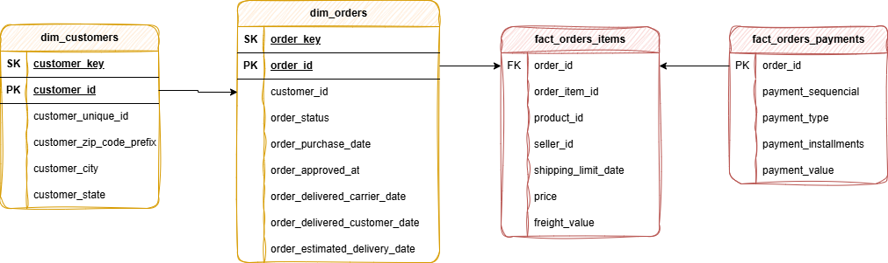

# 📊 Projeto de Engenharia de Dados — E-Commerce Analytics

Bem-vindo ao repositório do **Brazilian E-Commerce**!  
Este projeto demonstra uma solução completa de dados, desde a ingestão bruta até a geração de insights visuais em um dashboard interativo.

Desenvolvido como projeto de portfólio, ele destaca boas práticas utilizadas na área de **Engenharia de Dados**.

---

## 🏗️ Arquitetura de Dados

A arquitetura deste projeto segue o modelo **Medallion Architecture**, dividido em três camadas:

- 🥉 **Bronze (Bruta)**  
  Armazena os dados brutos exatamente como vêm das fontes (arquivos CSV).

- 🥈 **Silver (Tratada)**  
  Responsável pela limpeza, padronização, tipagem e enriquecimento dos dados.

- 🥇 **Gold (Analítica)**  
  Contém dados prontos para análise, organizados em modelo dimensional **Star Schema**, com tabelas fato, dimensão e mart final para consumo direto.

---

## 📖 Visão Geral do Projeto

Este projeto contempla:

- 📌 **Arquitetura de Dados**  
  Construção de um pipeline moderno com camadas Bronze, Silver e Gold seguindo a Medallion Architecture.

- 🔄 **Pipelines ETL**  
  Extração, transformação e carga de dados a partir de múltiplas fontes CSV de um dataset de e-commerce.

- 🧩 **Modelagem Dimensional**  
  Criação de tabelas fato e dimensão otimizadas para análise (Star Schema).

- 📊 **Dashboard Interativo**  
  Visualização dos dados via **Streamlit** com gráficos de vendas por estado, distribuição por faixa de valor e evolução mensal.

---

## 🧩 Modelo Dimensional (Star Schema)



---

## 📊 Dashboard

O dashboard foi construído com **Streamlit** , oferecendo:

- 🏆 **Top 5 estados** com maior volume de vendas
- 💰 **Distribuição por faixa de valor** dos pedidos (low, medium, high, premium)
- 📅 **Evolução mensal de vendas** com filtro por ano
- 🔢 **KPIs** — Receita total, total de pedidos, frete e ticket médio
- 🔍 **Filtros** por status do pedido e tipo de pagamento

---

## 🛠️ Ferramentas Utilizadas

- Apache Spark (PySpark) 3.5.1
- Python 3.8
- Pandas
- PyArrow
- Streamlit
- Docker / Docker Compose
- Parquet

---

## ▶️ Como Executar o Projeto

Siga os passos abaixo para rodar o projeto em sua máquina:

### 📥 1. Clonar o repositório

```bash
git clone https://github.com/seu-usuario/ecommerce-analytics.git
cd ecommerce-analytics
```

---

### 🐳 2. Subir os containers

O projeto roda inteiramente via Docker. Certifique-se de ter o **Docker** instalado.

```bash
docker compose up -d
```

Isso irá subir três containers:

| Container | Função |
|---|---|
| `spark-master` | Coordena o cluster Spark |
| `spark-worker` | Executa as tarefas do Spark |
| `jupyter` | Ambiente Python — roda o pipeline |

---

### ⚙️ 3. Executar o pipeline

```bash
docker exec -it jupyter python3 /opt/spark-src/main.py
```

O pipeline executa automaticamente as três camadas na seguinte ordem:

1. **Bronze** → Leitura dos CSVs e conversão para Parquet
2. **Silver** → Limpeza, tipagem e enriquecimento dos dados
3. **Gold** → Modelagem dimensional e geração do `mart_sales.parquet`

---

### 📊 4. Rodar o Dashboard

Após o pipeline finalizar, o dashboard irá carregar automaticamente no acesso: **http://localhost:8501**.

Caso queira rodar o Dashboard separadamente:

```bash
docker exec -it jupyter streamlit run /opt/spark-src/dash.py
```

Acesse em: **http://localhost:8501**

---

## 🗂️ Estrutura do Projeto

```
projeto/
├── src/
│   ├── bronze/          # Ingestão raw
│   ├── silver/          # Limpeza e enriquecimento
│   ├── gold/            # Modelagem dimensional + mart
│   ├── dash.py          # Dashboard Streamlit
│   └── main.py          # Orquestrador do pipeline
├── data/
│   ├── bronze/          # CSV bruto
│   ├── silver/          # CSV tratado
│   └── gold/            # CSV analítico + Parquet mart_sales
├── Dockerfile
└── docker-compose.yml
```

---

### 🎯 Objetivo

Desenvolver um pipeline de dados moderno para consolidar dados de vendas de um e-commerce e permitir análises estratégicas via dashboard.

---

### 📌 Especificações

- **Fonte de Dados**: Dataset de Brazilian E-Commerce com pedidos, itens, clientes e pagamentos (arquivos CSV)
 - https://www.kaggle.com/datasets/olistbr/brazilian-ecommerce
- **Qualidade dos Dados**: Limpeza e tratamento de inconsistências na camada Silver
- **Integração**: Unificação dos dados em um mart único para consumo pelo dashboard
- **Visualização**: Dashboard interativo com filtros dinâmicos

---

## 🧑‍💻 Autor

Desenvolvido por **Bruno Severgnini da Silva**

📌 Conecte-se comigo:
- LinkedIn: https://www.linkedin.com/in/bruno-severgnini-9049b8258/
- GitHub: https://github.com/BrunoSS80
